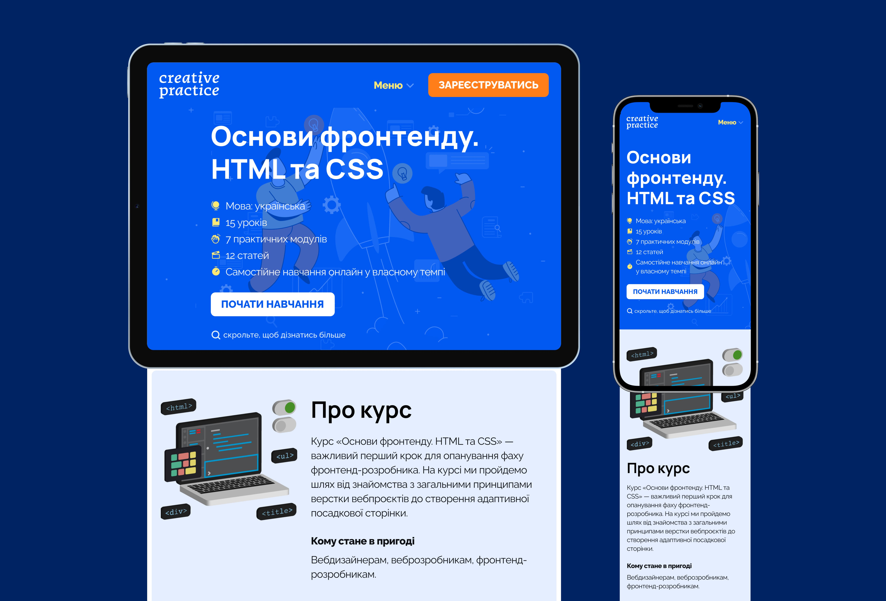

# Creating a Landing Page based on UI Kit: a case study for Creative Practice #5

## The outlines
As a UX/UI designer, it was important for me to learn the basics of the front-end for my work to:
* Build better ideas based on feasible solutions
* Know the potential boundaries, what’s possible/impossible to create
* To be more effective in working with the development team and understand their language
I started studying at Creative Practice and have already learned Visual Studio Code, the basic principles of HTML. In previous classes, I've found out how to connect CSS, make tables, and work with the block model, CSS selectors, pseudo-classes, pseudo-elements, and cross-platform. Also, I got acquainted with the flexboxes, grids, and position of elements and have created the form using common form elements.

I’ve completed the front-end web development course from Creative Practice, and the last work was to create a landing page. The development of the site is divided into two parts. In the first, I created a UI Kit, and in the second — a site based on the design layout and UI Kit.

## The goal
Create a Landing Page based on the UI Kit that I developed in the previous lesson (Creating a UI Kit: a case study for Creative Practice #4)

## The process and the result
1. I created the landing page based on a design layout and the UI Kit that I developed in the previous lesson. The page contains a header, which has a fixed position at the top when scrolling the page, blocks with a description of the program, a registration form, and a footer.
2. I adapted the page for different devices: computers, tablets, and phones.
3. I added a favicon, OG images, tags with the page title, and description.

#

P.S. I’ve successfully completed the task and even received an award for its accomplishment. It was an exciting experience, and I won’t stop my education in UX/UI and front-end. Thanks to the Creative Practice team and the teacher of the program — Anton Suprun!
